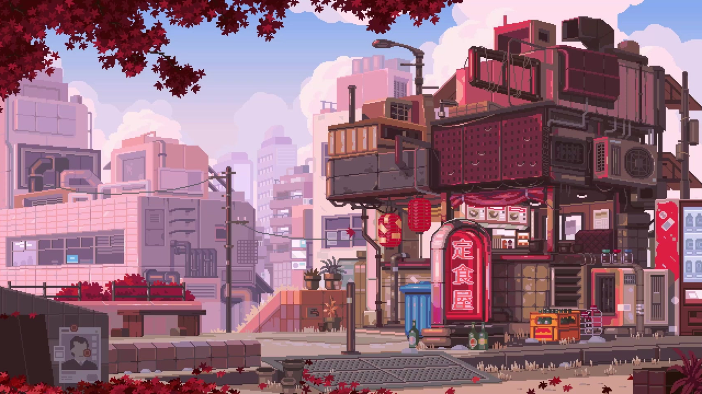

<div align="center">

  <!-- ==================== 1. CUSTOM WALLPAPER HEADER ==================== -->
  

  <br/><br/>

  <!-- Dynamic Typing Banner -->
  <a href="https://github.com/Dexorto1">
    
  </a>

  <p align="center">
    <a href="https://github.com/Dexorto1">
      
    </a>
    
    
    
  </p>

  <p align="center">
    <i>"Crafting high-performance CLI tools, intelligent automation engines, and bespoke Linux workflows."</i>
  </p>

</div>

<br/>

<!-- ==================== 2. INTRO & PHILOSOPHY ==================== -->
## 🌟 About Me & Philosophy

```text
┌─ 🚀 ABOUT DEXORTO ───────────────────────────────────────────────────────────────────┐
│ • 💻 Full-Stack & Automation Developer specializing in Python & Java systems         │
│ • ⚡ Deep focus on Terminal AI, Web Scraping Engines, and Custom Linux Workflows      │
│ • 🐧 Linux Enthusiast: Hyprland, KDE Plasma, LXQt custom ricing & script engineering │
│ • 🎯 Turning complex engineering tasks into 1-line automated CLI workflows           │
│ • 📍 Currently building ClientForge & Dex-Bot ecosystem                              │
└──────────────────────────────────────────────────────────────────────────────────────┘
```

### 🛠️ Languages & Arsenal

<div align="center">

  <p>
    
  </p>

  <br/>

  <table>
    <tr>
      <td align="center" width="25%"><b>💻 Core Languages</b></td>
      <td>
        
        
        
        
        
      </td>
    </tr>
    <tr>
      <td align="center"><b>⚙️ Systems & Linux</b></td>
      <td>
        
        
        
        
        
      </td>
    </tr>
    <tr>
      <td align="center"><b>🌐 Web & AI</b></td>
      <td>
        
        
        
        
      </td>
    </tr>
  </table>

</div>

<br/>

<!-- ==================== 3. FEATURED PROJECTS ==================== -->
## 🚀 Featured Projects

<div align="center">

<table>
  <tr>
    <td width="50%" valign="top">
      <h3 align="center">⭕ Dex-Bot CLI</h3>
      <p align="center">
        
        
      </p>
      <p>Intelligent terminal AI search, code generator, B2B lead prospector, GitHub explorer, and Lubuntu OS utility designed with an Antigravity USB Pendrive aesthetic.</p>
    </td>
    <td width="50%" valign="top">
      <h3 align="center">🛠️ ClientForge</h3>
      <p align="center">
        
        
      </p>
      <p>Autonomous B2B client acquisition engine. Discovers local business leads, performs instant 3-second technical & SEO audits, and generates high-converting PDF proposals.</p>
    </td>
  </tr>
  <tr>
    <td width="50%" valign="top">
      <h3 align="center">🛡️ Bit-Vault</h3>
      <p align="center">
        
        
      </p>
      <p>High-security encrypted personal vault and data storage interface designed for rapid credential, file, and secret management.</p>
    </td>
    <td width="50%" valign="top">
      <h3 align="center">🐧 Ubuntu Hyprland / KDE Dotfiles</h3>
      <p align="center">
        
        
      </p>
      <p>Ultra-clean Linux desktop environment configuration featuring custom widgets, status bars, and floating dock utilities.</p>
    </td>
  </tr>
</table>

</div>

<br/>

<!-- ==================== 4. LIVE GITHUB METRICS & LANGUAGES ==================== -->
## 📊 Live GitHub Analytics & Languages

<div align="center">

  <table border="0">
    <tr>
      <td align="center" width="50%">
        <!-- GitHub Stats Card -->
        
      </td>
      <td align="center" width="50%">
        <!-- Streak Stats Card -->
        
      </td>
    </tr>
    <tr>
      <td colspan="2" align="center">
        <!-- Top Languages Card with Python and Java priority -->
        
      </td>
    </tr>
  </table>

</div>

<br/>

<!-- ==================== 5. CONNECT BAR ==================== -->
## 🌐 Connect & Network

<div align="center">

  <a href="https://github.com/Dexorto1">
    
  </a>
  <a href="https://discord.com">
    
  </a>
  <a href="mailto:contact@dexorto.com">
    
  </a>

  <br/><br/>

  <!-- Animated Footer Wave -->
  

</div>
